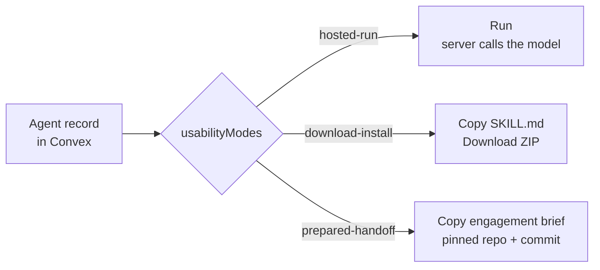
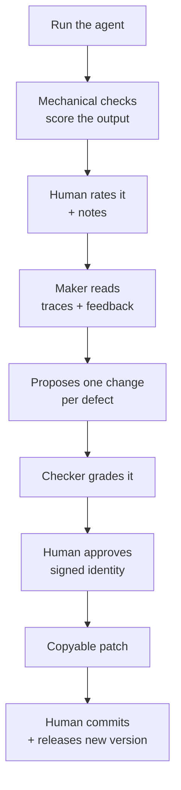
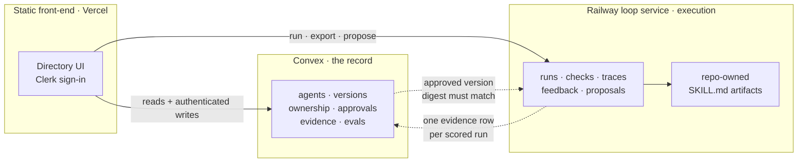

# Agents Directory

Utopia Studio's control plane for its agents.

The directory **owns the definition** of an agent — its goals, skills, tools, and
context. The platform it runs on (Claude, Codex, an HTTP endpoint) is an
interchangeable runtime behind an adapter. An agent isn't "a Claude project"; it's
a spec that currently runs on Claude and could run elsewhere.

**Live:** [agents-inventory.vercel.app](https://agents-inventory.vercel.app)

---

## Three ways to use an agent

Not a design preference — a fact about the fleet. Some agents are a prompt plus a
model. Others are credentialed, multi-step, or live in someone else's runtime. One
mechanism can't serve both.

An agent declares its modes in `usabilityModes[]`. It's an **array** — one agent can
be several at once.



### Hosted run — the directory executes it

For agents the server can run itself. A7 (Biocraft single-shot draft) is the one
registered today.

The prompt is loaded from a **repo-owned file**, never from the database record.
That's deliberate: if the runtime read a prompt from a writable record, anyone who
could write to the API could run arbitrary text on our API key.

Every run is pinned to an artifact version and a SHA-256 digest of the exact bytes
executed. Traces store **metadata only** — model, tokens, latency, cost, digest,
which checks failed. Never the input or output.

### Download-install — you run it

Copy the `SKILL.md` byte-for-byte, or download a ZIP with a generated manifest
carrying the digest, the artifact-declared guardrails and success criteria, install
instructions, and a return protocol.

### Prepared handoff — it lives somewhere else

For agents that can't be hosted here. A8 (UX&QA Agent) runs in Codex against a
credentialed browser session and has no endpoint.

The directory issues an **engagement brief** pinned to the repo and commit where the
agent actually lives. It **points at** the owner's instruction files rather than
copying them — a second copy drifts the moment the owner edits theirs, and nobody
notices.

The brief states plainly, in its first paragraph, that it is not the agent.

> ⚠️ These three are separate gates, never collapsed. A prepared-handoff agent isn't
> installed and isn't hosted, so an install-shaped export would be a fiction. An
> earlier version generated a skill file from directory metadata whose own step 1 read
> "open the agent in Codex" — a document claiming to be the agent while telling you to
> go and find it.

---

## The improvement loop

Runs on hosted agents. Evidence accumulates, the loop proposes, a human decides.



**Three rules hold throughout.**

**One defect per proposal.** Each is approved or rejected on its own. A proposal must
name a `prompt | check | runtime` surface, a concrete target, and at least one real
trace or feedback id — validated against records that exist.

**Approved is not applied.** Approval records a signed review decision and hands you
a patch. It edits no artifact, changes no prompt, bumps no governed version. The
prompt file is repo-owned; a human commits.

**The loop cannot approve itself.** `LOOP_AUTOAPPLY=true` fails boot. Verifier `ship`
is a recommendation that lands in an inbox. Auto-rejections are retained and
re-openable rather than deleted.

---

## Architecture

Two stores, one boundary, deliberately.



**Convex is the authority for the catalogue** — agents, insert-only version history,
ownership, approvals, evidence, eval sets. Release is a single transaction: only
`convex/reviews.ts` writes `currentApprovedVersionId`, in the same mutation that
records the review event.

**Railway executes** — runs, mechanical checks, traces, feedback, proposals, loop
history. On a mounted volume, so evidence survives deploys.

### The digest check, which is the most useful thing here

Before offering Run or Download, the UI compares the digest Railway serves against
the version Convex approved. **A mismatch refuses:**

> *Runtime version does not match the governed version. Deployment or approval is
> incomplete.*

That fired three times in one week, once an hour before a demo. Each time the fix was
to approve the version properly — never to disable the check. Editing the prompt file
changes its digest, which blocks execution until a human releases the new version. So
"versions are immutable" isn't a convention, it's enforced.

---

## Governance rules

Short version of the constraints this codebase holds itself to.

| Rule | Why |
|---|---|
| A value the system didn't measure is never rendered as though it did | Fleet health once averaged fabricated seed scores |
| A refusal is always visible, with a reason | A silent catch turned a clean 404 into an empty box |
| Artifacts are repo-owned; nothing writes them automatically | Closes the prompt-injection path |
| Digests are compared, not trusted | See above |
| Approval is a decision, not an application | "Approve" once implied a change shipped |
| Identity is never fabricated | A hardcoded commit SHA once shipped for a commit that didn't exist |

The recurring defect in this project was never broken features. It was **things that
looked like they worked** — a 201 wrapping an error, a test suite reporting four
passes having run nothing, a store that treated a failed read as an empty store and
seeded over it. Most of the hard work has gone into making failure visible.

---

## Repo layout

```
index.html · app.js · api.js · styles.css   Static front-end
frontend/                                    Convex + Clerk browser clients
convex/                                      Durable authority: schema, mutations, queries
convex/reviews.ts                            Approval as the sole release transaction
convex/lib/auth.ts                           requireIdentity / requireApprover (fail-closed)
server/src/invoke/                            Run adapters + repo-owned artifacts
server/src/handoff/                           Handoff registry
server/src/eval/                              Golden cases, mechanical compare
server/src/loop/                              Propose · verify · triage
docs/                                         Architecture, deployment, limitations
```

---

## Setup

**Convex backend**, from the repo root:

```sh
npm install
npm run build:frontend     # bundle clients + generate public deployment config
npm run convex:codegen
npm run typecheck
npm run test:convex
```

**Loop service:**

```sh
npm test  --prefix server
npm start --prefix server   # :8790
```

### Environment

| Where | Variable | Notes |
|---|---|---|
| Vercel | `CONVEX_URL` | Non-secret deployment URL |
| Vercel | `CLERK_PUBLISHABLE_KEY` | `pk_…`, public by design |
| Railway | `DATA_DIR` | **Must be `/data`** — a mounted volume |
| Railway | `ANTHROPIC_API_KEY` | Hosted runs |
| Railway | `CLERK_JWT_ISSUER_DOMAIN` | Or gated routes fail closed |
| Railway | `CONVEX_DEPLOY_KEY` | Evidence writes. See limitations — this is god-mode |

> ⚠️ Never put a Clerk **secret** key, a JWT, or a token in `deployment-config.js`.
> The frontend build writes that file into the browser bundle.

> ⚠️ `DATA_DIR` must be exactly `/data` on Railway and the volume must already exist.
> The service refuses to start otherwise rather than silently using ephemeral storage,
> which would look like persistence while wiping evidence on every deploy.

---

## Known limitations

There are a lot, they're deliberate, and they're written down properly in
**[docs/LIMITATIONS.md](docs/LIMITATIONS.md)**.

The headline ones:

- **Nothing in the fleet is genuinely single-shot.** A7 is a *reduced* version of
  Sarah's real `/biocraft`, which interviews you question by question and uses
  Chrome and Drive. Conversation state plus tool use is the next real capability.
- **Governed evaluation doesn't exist yet.** Mechanical checks run on every hosted
  run, but they are explicitly *not* eval scores. A governed `evalResult` needs a
  human judging against a rubric, and that rubric isn't authored.
- **Handoff results have no return path.** A completed engagement produces a report
  with a rating and there's nowhere in the product to put it.
- **Automation targets the legacy fixture fleet**, not the governed directory.
- **Clerk and Convex are development instances.** Users don't transfer to production,
  so ownership assignments aren't permanent.

---

## What's next

Sequencing lives in `docs/`. See
[ARCHITECTURE.md](docs/ARCHITECTURE.md),
[DEPLOYMENT.md](docs/DEPLOYMENT.md),
[LIMITATIONS.md](docs/LIMITATIONS.md), and
[AGENTS.md](AGENTS.md) for repo conventions.

- **Order 1** ✅ Convex schema, insert-only version history
- **Order 2** ✅ Approval as the sole release transaction
- **Order 3** 🔄 Railway writes durable evidence as a declared service principal.
  Remaining: verified service JWTs, and removing the loop service's own
  approve/reject path so approval authority lives only in Convex.
