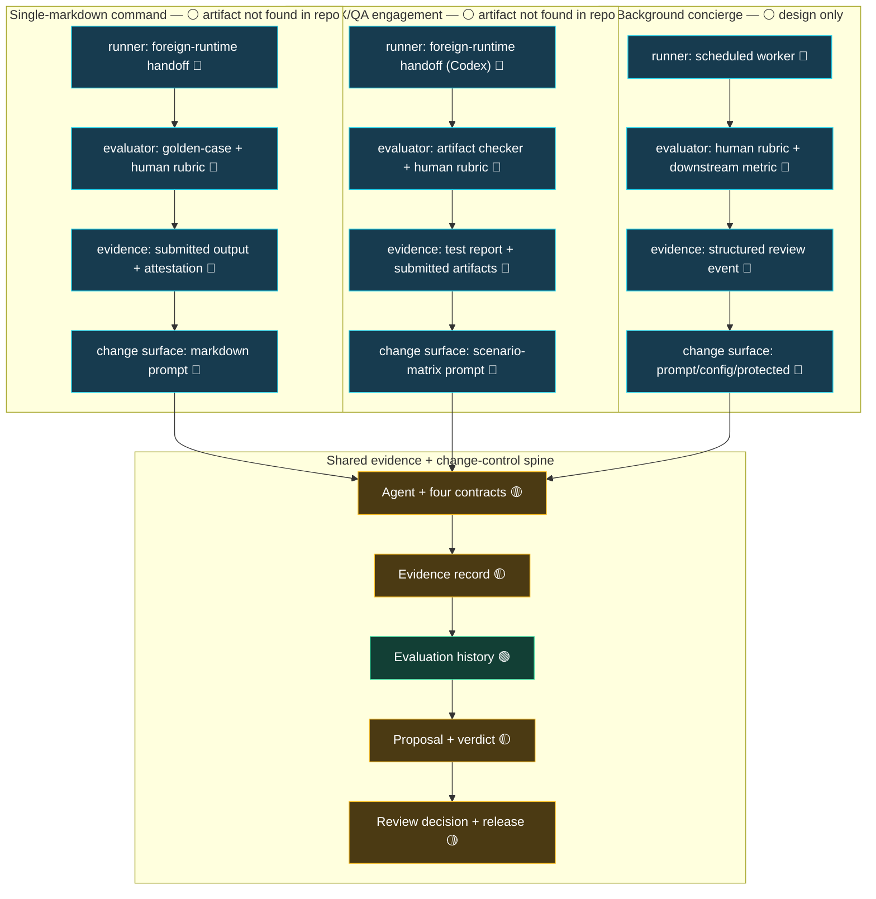

# D1 — Heterogeneity spine (Mermaid source)

> Status: 🟢 BUILT · 🟡 PARTIAL · 🔵 PROPOSED · ⚪ UNVERIFIED

```mermaid
flowchart TB
  classDef partial fill:#4b3a13,stroke:#fbbf24,color:#fff
  classDef proposed fill:#173b4f,stroke:#22d3ee,color:#fff
  classDef built fill:#123f35,stroke:#34d399,color:#fff

  subgraph Command["Single-markdown command — ⚪ artifact not found in repo"]
    C1["runner: foreign-runtime handoff 🔵"]:::proposed
    C2["evaluator: golden-case + human rubric 🔵"]:::proposed
    C3["evidence: submitted output + attestation 🔵"]:::proposed
    C4["change surface: markdown prompt 🔵"]:::proposed
    C1 --> C2 --> C3 --> C4
  end
  subgraph UX["Codex UX/QA engagement — ⚪ artifact not found in repo"]
    U1["runner: foreign-runtime handoff (Codex) 🔵"]:::proposed
    U2["evaluator: artifact checker + human rubric 🔵"]:::proposed
    U3["evidence: test report + submitted artifacts 🔵"]:::proposed
    U4["change surface: scenario-matrix prompt 🔵"]:::proposed
    U1 --> U2 --> U3 --> U4
  end
  subgraph Concierge["Background concierge — ⚪ design only"]
    B1["runner: scheduled worker 🔵"]:::proposed
    B2["evaluator: human rubric + downstream metric 🔵"]:::proposed
    B3["evidence: structured review event 🔵"]:::proposed
    B4["change surface: prompt/config/protected 🔵"]:::proposed
    B1 --> B2 --> B3 --> B4
  end
  subgraph Spine["Shared evidence + change-control spine"]
    S1["Agent + four contracts 🟡"]:::partial --> S2["Evidence record 🟡"]:::partial --> S3["Evaluation history 🟢"]:::built --> S4["Proposal + verdict 🟡"]:::partial --> S5["Review decision + release 🟡"]:::partial
  end
  C4 --> S1
  U4 --> S1
  B4 --> S1
```
